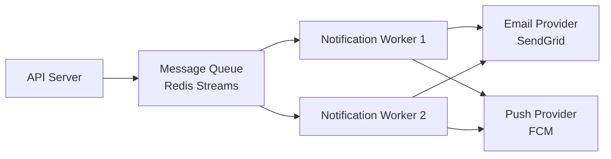

# Technical Design Documents, ADRs, and Engineering RFCs: A Structured Reference for Agentic SDLC Teams (2026)

> **Scope:** This report covers the three documents that answer *how* a system is built and *why* specific technical choices were made: the Technical Design Document (TDD), the Architecture Decision Record (ADR), and the Engineering RFC (Request for Comments). The audience is developers and tech leads working in agile teams where AI coding agents participate in the SDLC. These documents are downstream of the PRD (which answers *what* and *why* from a product perspective) and upstream of implementation.

---

## 1. How These Three Documents Relate

TDDs, ADRs, and RFCs operate at different levels of granularity and time horizon, but they answer the same root question: how do we build this, and how did we decide?

| Document | Grain | Time horizon | Primary audience |
|---|---|---|---|
| Engineering RFC | Proposal | Pre-decision | Team + stakeholders |
| Technical Design Document | Feature or system | Pre-implementation | Engineering team |
| Architecture Decision Record | Single decision | Permanent | Future engineers + agents |

A useful mental model: the RFC is a conversation, the TDD is a blueprint, and the ADR is the legal record. A team writes an RFC to propose a significant change, produces a TDD to specify how to implement the approved direction, and files ADRs to capture the individual architectural choices made along the way. They are complementary, not redundant.

In an agentic SDLC, all three serve a second function: they are context documents that AI planning and coding agents consume to generate, validate, or critique code. This dual purpose — human communication *and* machine context — shapes how each should be written.

> **Actionable takeaway:** Establish which of these three documents your team uses and when before starting a new project. Teams that conflate "RFC" and "TDD" end up either debating implementation details too early (RFC scope creep) or writing architecture retrospectively (TDD as post-hoc justification). Separate the artifacts, separate the conversations.

> **Agentic flag:** In agentic SDLC workflows, an AI orchestrator or planner agent may ingest all three document types before generating a task breakdown or code scaffolding. Consistent frontmatter (YAML metadata at the top of each document) lets agents parse status, scope, and ownership without reading the full prose.

---

## 2. Technical Design Document (TDD)

### 2.1 What a TDD Is (and Is Not)

A Technical Design Document specifies how a feature or system will be implemented. It translates the *what* from a PRD into an engineering blueprint: data models, API contracts, component responsibilities, deployment topology, and the specific decisions that constrain implementation.

**A TDD is:**
- A pre-implementation specification that guides engineers and reviewers
- The authoritative source of technical constraints, data schemas, and integration points
- A context artifact that AI coding agents ingest to generate well-scoped code
- A living document — updated as implementation reveals gaps in the original design

**A TDD is not:**
- A PRD (which answers *what* and *why* from a user/product perspective)
- An ADR (which captures a single architectural decision, not a full implementation plan)
- A post-implementation writeup — if written after the code, it loses its alignment value
- A substitute for code comments, API docs, or runbooks

### 2.2 Core Components

A lean but complete TDD for a web feature should include these sections. Omit none of them — the ones teams most often skip (NFRs, error handling, rollout strategy) are the ones that cause the most expensive late-stage rework.

**1. Context and Problem Statement**
One paragraph: what the system currently does, what is changing, and why. Link to the relevant PRD section. This is the section an AI agent reads first to establish scope.

**2. Goals and Non-Goals**
Explicit scope boundaries. "This TDD covers X. It does not cover Y." This prevents scope creep during review and tells agents what *not* to generate.

**3. Architectural Overview**
A high-level diagram (Mermaid or embedded image) showing affected components, their relationships, and data flow. Written diagrams age poorly; use a format that can be re-rendered from source.

**4. Data Design**
Database schema, entity relationships, migration strategy, and caching decisions. Include field types, constraints, and indexes for every new or changed table.

**5. API and Interface Specification**
For any new or modified API surface: endpoints, request/response shapes, HTTP status codes, authentication requirements, and rate limits. Reference the full OpenAPI spec if one exists (see Report 2).

**6. Component and Module Breakdown**
The individual units of implementation — services, classes, functions — with their responsibilities, inputs, outputs, and dependencies. This is where AI agents extract task lists.

**7. Non-Functional Requirements**
Performance targets (latency p95, throughput), security constraints (auth model, data encryption), scalability bounds, and accessibility requirements. State these as testable assertions, not intentions.

**8. Error Handling and Edge Cases**
What happens when things go wrong: error codes, retry strategy, circuit breakers, fallback behavior, and user-facing error messages. Skipping this section is the single most common TDD failure mode.

**9. Testing Strategy**
Unit test scope, integration test scope, performance test thresholds, and any manual QA checkpoints. Acceptance criteria from the PRD should map to specific tests here.

**10. Deployment and Rollout**
Environment progression (dev → staging → production), feature flags, rollback plan, observability (metrics, logs, alerts), and any database migration sequencing.

### 2.3 Annotated TDD Template

````markdown
---
# YAML frontmatter — machine-readable for agents and tooling
title: "User Notification Service — Async Delivery Refactor"
status: "draft"           # draft | in-review | approved | superseded
version: "0.3"
author: "eng-handle"
reviewers: ["lead-handle", "infra-handle"]
prd: "https://linear.app/team/PRD-142"
adrs: []                  # links to ADRs filed during design
created: "2026-03-15"
updated: "2026-03-22"
---

# Technical Design: Async Notification Delivery

## 1. Context and Problem Statement

The notification service currently delivers emails and push alerts
synchronously within the API request lifecycle. At 5,000 concurrent
users, this adds ~400ms to every action that triggers a notification
(see PRD-142, "Performance Problem Statement").

## 2. Goals and Non-Goals

**Goals:**
- Decouple notification delivery from the request path
- Achieve p95 notification latency < 3 seconds
- Support retry-with-backoff for failed deliveries

**Non-Goals:**
- Real-time delivery SLAs (< 1 second) — out of scope for this phase
- Notification preference management UI — covered by PRD-155

## 3. Architectural Overview

<!-- Mermaid diagram — renders in GitHub and most doc tools -->


## 4. Data Design

**New table: `notification_jobs`**

| Column | Type | Constraints |
|---|---|---|
| id | uuid | PRIMARY KEY |
| user_id | uuid | FK → users.id, NOT NULL |
| channel | enum('email','push') | NOT NULL |
| payload | jsonb | NOT NULL |
| status | enum('queued','sent','failed') | DEFAULT 'queued' |
| attempts | int | DEFAULT 0 |
| scheduled_at | timestamptz | NOT NULL |
| sent_at | timestamptz | NULLABLE |

## 5. API and Interface Specification

**POST /api/v2/notifications/queue**

Request body:
```json
{
  "user_id": "uuid",
  "channel": "email | push",
  "template_id": "string",
  "context": {}           // template variable substitutions
}
```

Response 202 Accepted:
```json
{ "job_id": "uuid", "estimated_delivery_ms": 2000 }
```

Errors: 400 (invalid payload), 429 (rate limit), 503 (queue unavailable)

## 6. Component and Module Breakdown

- **`NotificationQueue`** (src/services/notification-queue.ts)
  - Accepts job payloads, validates schema, enqueues to Redis Streams
  - Dependencies: RedisClient, NotificationJobValidator

- **`NotificationWorker`** (src/workers/notification-worker.ts)
  - Consumes from queue, dispatches to channel providers
  - Implements exponential backoff: 1s, 5s, 30s, 5m (max 4 attempts)
  - Dependencies: SendGridClient, FCMClient, NotificationJobRepository

## 7. Non-Functional Requirements

- p95 end-to-end notification latency: ≤ 3,000ms
- Worker throughput: ≥ 500 jobs/second per worker instance
- Queue depth alert: trigger PagerDuty if depth > 10,000 for > 60 seconds
- All PII in payload encrypted at rest (AES-256)

## 8. Error Handling and Edge Cases

- **Provider timeout (> 5s):** mark as failed, enqueue retry
- **Duplicate job IDs:** idempotency key on `notification_jobs.id` prevents double-delivery
- **Queue unavailable:** API returns 503 with `Retry-After: 10` header
- **Permanent failure (4 attempts exhausted):** status → 'failed', emit `notification.failed` event to dead-letter stream

## 9. Testing Strategy

- Unit: `NotificationQueue` validation logic (invalid payload shapes)
- Unit: Worker retry/backoff logic (mocked provider failures)
- Integration: full queue → worker → provider pipeline in staging
- Load test: 1,000 concurrent enqueue calls; assert p95 < 200ms enqueue time
- Acceptance criteria mapping: PRD-142 AC-3, AC-4

## 10. Deployment and Rollout

1. Deploy schema migration (additive — no downtime)
2. Deploy workers behind `feature_flag: async_notifications`
3. Enable flag for 1% of traffic; monitor queue depth and latency for 24h
4. Ramp to 100% over 3 days
5. Rollback: disable flag; synchronous path remains in place for 30 days
````

### 2.4 Common TDD Failure Modes

**Written after the code.** A TDD written retrospectively captures what was built, not the decisions made. It provides no alignment value and misleads future engineers. Write the TDD before implementation begins, even a short one.

**Missing non-functional requirements.** Teams describe *what* the feature does but not *how well* it must perform. Performance regressions and security gaps discovered in production trace back to absent NFRs.

**No error handling section.** The happy path is easy to specify; the error path is where systems actually break. Agents given a TDD without error handling will generate code that is brittle under failure.

**Living in a silo.** A TDD that only one engineer reads is a private notebook. Require at least two reviewers before implementation begins.

**Diagrams not in source control.** Screenshots of Miro boards become stale within weeks. Use Mermaid, PlantUML, or other text-based formats that render from markup.

> **Actionable takeaway:** Gate feature branch creation on a TDD in "approved" status. This single process rule eliminates a large class of mid-sprint architecture debates.

> **Agentic flag:** When feeding a TDD to an AI coding agent (Claude Code, Cursor, etc.), the agent uses sections 5 (API), 6 (components), and 7 (NFRs) most heavily. If those sections are vague or missing, the agent will hallucinate interface contracts or skip error handling. Write those three sections with precision even if the rest of the TDD is still a draft.

---

## 3. Architecture Decision Records (ADRs)

### 3.1 What an ADR Is (and Is Not)

An Architecture Decision Record documents a single significant architectural or design decision: the context that made it necessary, the options that were considered, and the reasoning behind the choice made. ADRs were popularized by Michael Nygard in 2011 and have become a standard practice in mature engineering teams.

**An ADR is:**
- A permanent, append-only record of a single decision
- A knowledge-sharing artifact that explains *why* a codebase looks the way it does
- A context document that prevents teams from relitigating settled decisions
- A machine-parseable specification when written in structured Markdown (MADR format)

**An ADR is not:**
- A TDD — it documents a decision, not an implementation plan
- A changelog entry — ADRs capture reasoning, not just what changed
- A living document that is edited when new information arrives (new information = new ADR that supersedes the old one)
- Restricted to architecture — ADRs are useful for any decision with lasting consequences: library choices, data modeling conventions, CI/CD tooling, security patterns

### 3.2 The ADR Lifecycle

Each ADR carries a status that signals its current standing:

| Status | Meaning |
|---|---|
| `Proposed` | Under discussion — not yet adopted |
| `Accepted` | The team adopted this decision |
| `Rejected` | The team explicitly declined this option |
| `Deprecated` | Still in effect but being phased out |
| `Superseded by ADR-NNN` | Replaced by a newer decision |

The status field is the single most important property for agents parsing a decision log — it tells them whether a constraint is currently active.

### 3.3 The MADR Template

The Markdown Architectural Decision Records (MADR) format, maintained at [adr.github.io](https://adr.github.io/), is the most widely adopted structured ADR template as of 2026. It is designed to be both human-readable and machine-parseable.

```markdown
---
# YAML frontmatter — enables automated tooling and agent parsing
adr_id: "0012"
title: "Use Redis Streams for async job queues"
status: "accepted"          # proposed | accepted | rejected | deprecated | superseded
date: "2026-03-20"
deciders: ["eng-lead", "infra-lead"]
consulted: ["security-team"]
informed: ["product-team"]
supersedes: null
superseded_by: null
tags: ["infrastructure", "async", "queue"]   # enables filtered queries by agents
---

# ADR-0012: Use Redis Streams for async job queues

## Status

Accepted — 2026-03-20

## Context

The notification service is being refactored to deliver messages
asynchronously (see TDD-142). We need a queue mechanism that supports:
- At-least-once delivery with acknowledgement
- Consumer groups for horizontal scaling
- Message replay for debugging
- Low operational overhead for a team of 4 engineers

## Decision

We will use **Redis Streams** (via the `ioredis` client) as the message
queue for the notification worker pipeline.

## Considered Alternatives

| Option | Pros | Cons |
|---|---|---|
| Redis Streams | Already in stack; consumer groups; low ops overhead | Not a dedicated MQ; no built-in DLQ |
| RabbitMQ | Mature; rich routing; dedicated DLQ | New infrastructure dependency; ops overhead |
| AWS SQS | Managed; scales infinitely | Cloud vendor lock-in; adds latency vs. in-cluster |
| PostgreSQL SKIP LOCKED | Zero new dependencies | Not designed for high-throughput queuing |

## Rationale

Redis Streams provides consumer group semantics (required for worker
scaling), message acknowledgement (required for at-least-once delivery),
and replay capability (required for debugging). The team already
operates Redis for session caching — adding Streams avoids a new
operational dependency. RabbitMQ was the strongest alternative but
the ops overhead was disproportionate for a team of this size.

## Consequences

**Positive:**
- No new infrastructure dependency
- Consumer group model enables horizontal worker scaling without coordination
- Message replay simplifies debugging and incident response

**Negative:**
- Redis is not designed as a primary message broker; we accept the risk of
  lost messages if Redis is unavailable (mitigated by Circuit Breaker pattern)
- Dead-letter queue must be implemented manually (see ADR-0013)
- Team must learn Streams API (estimated: 1 day)

## Related Decisions

- ADR-0008: Use Redis for session caching
- ADR-0013: Dead-letter queue pattern for failed notifications (proposed)
- TDD-142: Async Notification Delivery
```

### 3.4 Tooling

- **adr-tools CLI** ([github.com/npryce/adr-tools](https://github.com/npryce/adr-tools)): command-line tool for creating, linking, and superseding ADRs in a Git repo
- **Log4brains**: generates a static HTML decision log from Markdown ADRs; integrates with GitHub Actions for auto-publish
- **GitHub + CODEOWNERS**: place `/docs/adr/` under CODEOWNERS so any new ADR triggers a review request from senior engineers
- **Cursor / Claude Code context**: add `/docs/adr/` to your agent's context window or knowledge base so the agent understands existing architectural constraints before generating code

### 3.5 Continuous ADR Generation with AI Agents

The most effective pattern emerging in 2025–2026 is *continuous* ADR generation integrated into the development workflow. The approach, documented by [Adolfi.dev](https://adolfi.dev/blog/ai-generated-adr/) and [Piethein Strengholt](https://piethein.medium.com/building-an-architecture-decision-record-writer-agent-a74f8f739271), has two components:

1. **Retroactive scan**: An agent scans the codebase and generates ADRs for decisions that were implemented but never documented. These "undocumented decisions hiding in plain sight" include library choices visible in `package.json`, infrastructure choices in `terraform/`, and patterns in code structure.

2. **Ongoing generation**: Add a standing instruction to your agent configuration — *"Always propose an ADR when you make a change that affects overall architecture."* This captures reasoning while the work is fresh, preventing context loss.

A multi-agent pipeline for ADR validation uses three specialized agents: an ADR Writer (generates draft from context), a Validator (checks all mandatory fields are present), and a Markdown Writer (formats and persists). This ensures every filed ADR is structurally complete before it enters the decision log.

> **Actionable takeaway:** Start your ADR log on the first day of a project, not after the first architectural crisis. Create a `/docs/adr/` folder, add an `overview.md` index file, and file the first ADR for your most basic choice (monorepo vs. polyrepo, target runtime, etc.). The habit compounds.

> **Agentic flag:** ADRs are the highest-signal context an AI agent can have about a codebase. An agent reading 20 ADRs understands *why* the code looks the way it does — not just *what* it does. Tag ADRs with `tags:` arrays in frontmatter so agents can filter for decisions relevant to a specific domain (e.g., `tags: ["security", "auth"]`).

---

## 4. Engineering RFCs

### 4.1 What an RFC Is (and Is Not)

An Engineering RFC (Request for Comments) is a written proposal for a significant technical change that invites structured feedback from the team before any decision is made. The format was popularized in open-source communities (Rust, React, Ember) and adopted by engineering organizations as a way to make decisions asynchronously and at scale.

**An RFC is:**
- A time-bounded conversation artifact — it exists to collect feedback, then close
- A democratic process that distributes decision-making beyond a single architect
- A written record of alternatives considered and concerns raised, even if rejected
- Particularly valuable for cross-team changes that affect multiple domains

**An RFC is not:**
- A TDD — it is a proposal, not a specification; writing code while an RFC is open is premature
- An ADR — it precedes the decision; the ADR records what the RFC process decided
- Bureaucracy for its own sake — small, reversible changes do not need an RFC
- A synchronous meeting replacement (though RFC authors often hold a review call)

The distinction from a TDD is critical: an RFC asks "should we do this, and how?" — a TDD assumes the answer is yes and specifies the details.

### 4.2 When to Write an RFC

The [Pragmatic Engineer](https://blog.pragmaticengineer.com/scaling-engineering-teams-via-writing-things-down-rfcs/) recommends an RFC for "every project beyond some super trivial complexity." A more useful heuristic:

**Write an RFC when the change:**
- Affects the public API surface of a service consumed by other teams
- Introduces a new technology, library, or infrastructure component
- Changes a convention or pattern used across multiple codebases
- Has a non-trivial rollback cost if the decision turns out to be wrong
- Would benefit from expertise that a single engineer does not possess

**Skip an RFC when the change:**
- Is fully contained within one service and affects no external consumers
- Is easily reversible within one sprint
- Has an obvious, uncontested solution (write the ADR instead)

### 4.3 RFC Process Mechanics

A healthy RFC process has four stages:

1. **Draft**: Author writes the RFC and shares it with 1–2 trusted reviewers for early feedback before wider distribution
2. **Open for comment**: RFC is published (GitHub PR, Notion, Confluence) with a defined comment window (typically 5–10 business days). All feedback is written and asynchronous
3. **Resolution**: Author synthesizes feedback, updates the RFC, and — with designated approvers — marks it Accepted, Rejected, or Withdrawn
4. **Archival**: Accepted RFCs become permanent records; the resulting implementation decision is filed as an ADR; the TDD is written against the accepted direction

### 4.4 Annotated RFC Template

```markdown
---
# YAML frontmatter — machine-readable metadata
rfc_id: "RFC-0041"
title: "Migrate authentication from JWT to session tokens"
status: "open"            # draft | open | accepted | rejected | withdrawn
author: "eng-handle"
created: "2026-03-10"
comment_deadline: "2026-03-20"
approvers: ["security-lead", "platform-lead"]
related_adrs: []          # filled after RFC is accepted
related_rfcs: ["RFC-0028"]
---

# RFC-0041: Migrate Authentication from JWT to Session Tokens

## Summary

A one-paragraph plain-English description of the proposal. Explain
what is changing and why, without assuming the reader knows the
current system in detail. This is the section an AI agent reads
to classify the RFC's domain and scope.

## Motivation

Why is this change needed now? What problem does the current approach
create? Include data or incidents that validate the problem.

Example: "In 3 of the last 4 security audits, reviewers flagged JWT
token revocation as a critical gap. Our current JWTs have a 24h TTL
with no server-side invalidation capability."

## Detailed Design

The proposed technical solution. Include:
- What specifically changes (interfaces, data models, config)
- Migration strategy for existing users/data
- Impact on dependent services (list them)

This section is where peer review is most valuable — write it to
invite critique, not to defend a conclusion.

## Alternatives Considered

| Option | Why not chosen |
|---|---|
| Shorten JWT TTL to 15 minutes | Increases token refresh load; doesn't solve revocation |
| Add token denylist to Redis | Operational complexity; still need session store anyway |
| Keep current approach | Unacceptable security posture per audit findings |

## Drawbacks and Risks

Honest assessment of downsides. An RFC with no drawbacks signals
the author hasn't thought hard enough. Common categories:
- Performance impact
- Increased operational complexity
- Breaking changes for API consumers
- Migration risk

## Rollout Strategy

How does this change reach production safely? Feature flags,
migration windows, rollback plan, communication to affected teams.

## Open Questions

List unresolved questions that reviewers should address.
Example: "Should we invalidate all existing JWT sessions on cutover,
or allow a 7-day parallel period?"

## Approval

| Approver | Status | Date |
|---|---|---|
| security-lead | pending | — |
| platform-lead | pending | — |
```

### 4.5 Common RFC Failure Modes

**RFC as rubber stamp.** If RFCs are always approved exactly as written, the process is either selecting too small a scope or not attracting genuine review. The Pragmatic Engineer notes that RFCs only work "in settings with an already-established culture of trust, autonomy, and responsibility."

**Unbounded comment windows.** An RFC open for 30 days accumulates conflicting feedback that is impossible to synthesize. Cap comment windows at 5–10 business days and enforce them.

**No designated approvers.** Without named approvers, RFCs linger indefinitely. Assign 2–3 approvers with domain expertise at creation time.

**Writing the TDD before the RFC is accepted.** This signals the decision is already made, undermining the process and discouraging honest feedback.

**Conflating RFC with TDD.** Teams sometimes expect the RFC to contain full implementation detail. Keep the RFC at the "should we / how roughly" level; save the precise specification for the TDD.

> **Actionable takeaway:** Pair every RFC with an explicit deadline and named approvers at creation time. If an RFC cannot be resolved within its comment window, schedule a 30-minute synchronous call to break the deadlock — do not let it become a permanent backlog item.

> **Agentic flag:** An AI agent reading an RFC can generate a first draft of the TDD that would implement the accepted direction, and can generate the ADR that should be filed upon acceptance. This creates a document pipeline: RFC acceptance triggers an agent to draft TDD + ADR stubs for human review, reducing the documentation burden on engineers.

---

## 5. How AI Agents Consume These Documents

### 5.1 Machine-Readable Properties That Matter

All three document types benefit from consistent YAML frontmatter — the fields that matter most for agent parsing are:

| Field | Why agents need it |
|---|---|
| `status` | Determines whether the document represents an active constraint |
| `title` | Enables semantic search and classification |
| `tags` | Allows filtered retrieval (e.g., "all security-related ADRs") |
| `related_adrs` / `related_rfcs` | Enables graph traversal of decision history |
| `prd` / `tdd` | Links decisions back to requirements for traceability |
| `created` / `updated` | Temporal context for freshness assessment |

### 5.2 Structural Patterns That Improve Agent Comprehension

**Explicit non-goals.** Agents do not automatically infer boundaries from omissions. Stating "this TDD does not cover X" prevents agents from generating code for out-of-scope requirements.

**Consequence tables in ADRs.** The `Consequences` section with explicit positive/negative breakdown gives agents a machine-readable risk model for the decision.

**Consistent section order.** When documents follow a predictable structure, agents can locate the data model section, the API section, or the error-handling section without reading the entire document. This matters at context window limits.

**Links between documents.** An ADR that links to the TDD that links to the PRD creates a traversable knowledge graph. Agents can follow these links to resolve ambiguity.

### 5.3 The AgenticAKM Pattern

Research published in early 2026 (arxiv.org/html/2602.04445) describes an *Agentic Architecture Knowledge Management* system using four specialized agents coordinated by an orchestrator:

1. **Architecture Extraction Agent**: reads source code, infrastructure configs, and dependency files to surface implicit architectural decisions
2. **Retrieval Agent**: queries the existing ADR log to find related decisions
3. **Generation Agent**: drafts new ADRs using the MADR template
4. **Validation Agent**: checks structural completeness before the ADR is filed

This pattern addresses the core problem of knowledge decay: the decisions made during a sprint are captured automatically, not months later when context has been lost.

> **Actionable takeaway:** Store TDDs, ADRs, and RFCs in the same Git repository as the code they describe. This co-location means agent context windows can include the relevant decision history alongside the source files, without requiring separate retrieval steps.

> **Agentic flag:** When configuring a Claude Code or Cursor workspace, add a `.claude/rules/` or `.cursorrules` file instructing the agent to: (1) check for an existing ADR before proposing an architectural change, (2) flag conflicts with active ADRs, and (3) draft an ADR stub when a new architectural choice is made. This embeds the decision-capture discipline directly into the coding workflow.

---

## 6. Tooling

| Tool | Use case | Notes |
|---|---|---|
| **GitHub (Markdown + PRs)** | TDDs, ADRs, RFCs as `.md` files in `/docs/` | PR review process doubles as RFC/TDD review |
| **adr-tools CLI** | ADR creation, linking, superseding | Maintains `index.md` automatically |
| **Log4brains** | Rendered ADR decision log (HTML) | GitHub Actions integration for auto-publish |
| **Notion / Confluence** | TDDs and RFCs for teams preferring rich editing | Export to Markdown for agent ingestion |
| **Linear / Jira** | Linking TDDs to tickets | Embed TDD URL in ticket description |
| **Mermaid** | Architecture diagrams embedded in Markdown | Renders natively in GitHub, Notion, GitLab |
| **Claude Code / Cursor** | Agent ingestion of TDDs and ADRs | Add `/docs/` to agent context; use `.claude/rules/` for standing instructions |

---

## 7. Common Failure Modes Across All Three Documents

**Documentation as ceremony.** Teams write TDDs, ADRs, and RFCs to satisfy a process checkbox, then ignore them during implementation. The documents only produce value if engineers read and reference them during the build.

**No status discipline.** Documents with stale or missing status fields create confusion: is this still the plan? Was this decision reversed? Update status fields as reality changes — especially "superseded" links in ADRs.

**Too long to read.** A TDD that takes 2 hours to read will not be read. Aim for TDDs under 1,500 words for individual features. For system-level TDDs, use a summary section at the top that can be read in 5 minutes.

**Not co-located with code.** Documentation stored in a wiki that is not linked from the codebase becomes invisible. Keep references bidirectional: code comments should link to ADRs; ADRs should link to the code files they constrain.

**Reinventing settled decisions.** Without an ADR log, teams revisit the same architectural debates repeatedly — the "why don't we just use PostgreSQL as a queue?" conversation that happens every 6 months. ADRs make the record of settled debates permanent and searchable.

---

## Sources

- [adr.github.io — Architectural Decision Records](https://adr.github.io/)
- [Scaling Engineering Teams via RFCs — The Pragmatic Engineer](https://blog.pragmaticengineer.com/scaling-engineering-teams-via-writing-things-down-rfcs/)
- [Building an ADR Writer Agent — Piethein Strengholt, Medium](https://piethein.medium.com/building-an-architecture-decision-record-writer-agent-a74f8f739271)
- [AI-Generated ADRs — Adolfi.dev](https://adolfi.dev/blog/ai-generated-adr/)
- [AgenticAKM: Agentic Architecture Knowledge Management — arXiv 2602.04445](https://arxiv.org/html/2602.04445)
- [Technical Design Document Guide — DEV Community](https://dev.to/siddharth_g/demystifying-the-technical-design-document-a-guide-for-software-engineers-1fk1)
- [Engineering Planning with RFCs, Design Docs, and ADRs — Pragmatic Engineer Newsletter](https://newsletter.pragmaticengineer.com/p/rfcs-and-design-docs)
- [Accelerating ADRs with Generative AI — Equal Experts](https://www.equalexperts.com/blog/our-thinking/accelerating-architectural-decision-records-adrs-with-generative-ai/)
